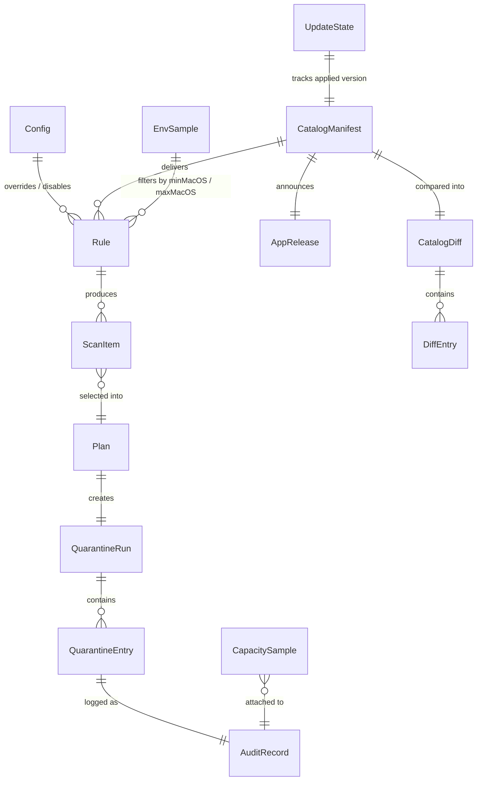

> 責務: データモデル全体（§5）— エンティティ・関係・ストレージ・永続化設定をここに集約。
> 親: ../REQUIREMENTS.md

## 5. Data Model

### 5.1 Entities

| Entity | Description | Key Fields |
|---|---|---|
| `Rule` | クリーンアップ対象 1 件の定義。同梱 JSON とユーザー JSON の両方でこの形 | `id: String`（kebab-case, 一意）, `title: String`, `titleJa: String`, `tier: Tier`, `kind: RuleKind`, `paths: [String]?`（`~` 展開可、`directory` 型で必須）, `command: CommandSpec?`（`command` 型で必須）, `sizeProbe: CommandSpec?`, `detect: CommandSpec?`, `minAgeDays: Int?`, `requiresQuitApps: [String]?`（バンドル ID）, `whatIsLost: String`, `whatIsLostJa: String`, `manualSteps: String?`（Tier C で必須）, `enabled: Bool`（既定 true）, `timeoutSeconds: Int`（既定 180、最大 900）, `minMacOS: String?`（例 `"14.0"`。未指定は下限なし）, `maxMacOS: String?`（例 `"26.99"`。未指定は上限なし）, `verifiedOn: String?`（このルールを最後に実機確認した OS ビルド。例 `"25F84"`） |
| `Tier` | リスク階層 | `A`（既定選択）/ `B`（要確認・既定未選択）/ `C`（提示のみ・選択不可） |
| `RuleKind` | 処理方式 | `directory`（隔離庫へ移動、undo 可）/ `command`（外部コマンド実行、undo 不可）/ `report`（計測と表示のみ） |
| `PathsFrom` | 対象の場所をツールに聞く指定 | `command: CommandSpec`（場所を答えるコマンド）, `subpaths: [String]`（その下の実際の格納場所）。同じルールの `paths` は、ツールが答えられないときの控えとして使う |
| `MeasureSpec` | `command` 型の対象量の測り方 | `kind: paths \| commandPath \| dockerReclaimable \| simctlUnavailable`, `paths: [String]?`, `command: CommandSpec?` |
| `CommandSpec` | 外部コマンド 1 件 | `executable: String`（絶対パスまたは PATH 探索名）, `arguments: [String]`, `expectSuccess: Bool`（既定 true） |
| `ScanItem` | スキャン結果 1 件 | `ruleId: String`, `tier: Tier`, `title: String`, `bytes: Int64`（実割当サイズ合計）, `fileCount: Int`, `paths: [String]`, `state: ItemState`, `reason: String?`, `dataless: Bool`, `cacheHit: Bool`, `sizeKnown: Bool`（false は「不明」であり 0 バイトではない） |
| `ItemState` | 項目の状態 | `ready` / `blocked`（権限で測定不能）/ `skipped`（対象なし・ツール未検出・条件未達） |
| `Plan` | 実行計画 | `runId: String`（ULID, 26 文字）, `createdAt: Date`, `selected: [ScanItem]`, `totalBytes: Int64` |
| `QuarantineRun` | 隔離 1 回分 | `runId: String`, `createdAt: Date`, `expiresAt: Date`, `entries: [QuarantineEntry]`, `totalBytes: Int64` |
| `QuarantineEntry` | 隔離された項目 1 件 | `ruleId: String`, `originalPath: String`（絶対パス）, `quarantineRelativePath: String`（run ディレクトリからの相対）, `bytes: Int64`, `isDirectory: Bool`, `movedAt: Date` |
| `AuditRecord` | 監査ログ 1 行 | `ts: Date`（ISO8601, ミリ秒・タイムゾーン付き）, `action: AuditAction`, `runId: String`, `ruleId: String`, `path: String?`, `bytes: Int64`, `result: ResultKind`, `reason: String?`, `toolExitCode: Int?`, `toolOutputHead: String?`（先頭 4KiB）, `osVersion: String`, `osBuild: String`, `catalogVersion: Int`（その操作時に有効だったカタログ版数） |
| `AuditAction` | 記録対象の操作 | `apply` / `undo` / `purge` / `commandRun` / `catalogUpdate`（カタログの適用・自動適用・拒否）/ `appUpdate`（本体成果物の取得と検証） |
| `ResultKind` | 操作結果 | `ok` / `skipped` / `failed` |
| `CapacitySample` | 容量計測 1 回分 | `at: Date`, `strictBytes: Int64?`, `importantBytes: Int64?`, `snapshotCount: Int?` |
| `CatalogManifest` | 配信されるカタログ 1 版分のメタデータ（署名対象） | `schemaVersion: Int`, `catalogVersion: Int`（単調増加）, `publishedAt: Date`, `expiresAt: Date`（発行から 90 日）, `minDiscleanVersion: String`, `keyId: String`, `files: [{name, sha256, bytes}]`, `revocations: [String]`（無効化する `Rule.id`）, `latestApp: AppRelease` |
| `AppRelease` | manifest に同梱する本体の最新版情報 | `version: String`, `minMacOS: String`, `assets: [{name, url, sha256, bytes}]` |
| `CatalogDiff` | 現行カタログと staged カタログの差分 | `expanding: [DiffEntry]`, `shrinking: [DiffEntry]`, `neutral: [DiffEntry]` |
| `DiffEntry` | 差分 1 件 | `ruleId: String`, `change: ChangeKind`, `before: String?`, `after: String?`, `newPaths: [String]` |
| `ChangeKind` | 差分の種類 | `ruleAdded` / `ruleRemoved` / `pathAdded` / `pathRemoved` / `tierRaised` / `tierLowered` / `commandChanged` / `ageRelaxed` / `ageTightened` / `osScopeWidened` / `osScopeNarrowed` / `revoked` / `textChanged` |
| `UpdateState` | 更新の進行状態（永続化） | `schemaVersion: Int`, `appliedCatalogVersion: Int`, `appliedAt: Date?`, `stagedCatalogVersion: Int?`, `lastCheckedAt: Date?`, `lastCheckResult: CheckResult`, `lastFailureReason: String?`, `availableAppVersion: String?`, `installMethod: InstallMethod` |
| `CheckResult` | 直近の更新チェックの結果 | `ok` / `noUpdate` / `pendingApproval` / `networkError` / `rejected` |
| `InstallMethod` | 本体の導入経路 | `brew` / `app` / `manual` |
| `EnvSample` | 実行環境の記録（OS ドリフト判定用） | `osVersion: String`, `osBuild: String`, `arch: String`, `discleanVersion: String`, `recordedAt: Date` |
| `Config` | ユーザー設定 | `quarantineTtlDays: Int`（1〜90, 既定 7）, `concurrency: Int`（1〜32, 既定 `min(8, activeProcessorCount)`）, `excludedPaths: [String]`（既定 `["~/Sync"]`）, `autoUpdate: Bool`（既定 true）, `updateIntervalHours: Int`（1〜168, 既定 24）, `updateEndpoint: String`（既定 GitHub Releases。§6.6）, `schemaVersion: Int` |

### 5.2 Relationships

- `Rule.id` は全カタログで一意。ユーザールールが同じ `id` を持つ場合は同梱ルールを **置換** する（マージではない）。
- `QuarantineRun.runId` は隔離庫のディレクトリ名でもある（`$DISCLEAN_STATE_DIR/quarantine/<runId>/`）。
- `AuditRecord` は追記専用。既存行の書き換え・削除は行わない（`purge` も新しい行として記録する）。
- カタログの適用優先順位は **同梱 < 自動更新（`active`）< ユーザー（`rules.d`）**。同一 `id` はより優先度の高い側が置換する。自動更新がユーザー定義を書き換えることはない。
- `CatalogManifest.catalogVersion` は単調増加。`UpdateState.appliedCatalogVersion` 以下の manifest は巻き戻しとして拒否する。
- `CatalogManifest.revocations` に載った `Rule.id` は、承認を待たずに無効化する（削除対象が減る方向のみ自動適用する — F-17）。

### 5.3 Storage

- **Where**:
  - ルール（同梱）: 実行ファイル内のリソース（SwiftPM `.process("Resources/rules")`）
  - ルール（ユーザー）: `$DISCLEAN_CONFIG_DIR/rules.d/*.json`（既定 `~/.config/disclean/rules.d/`）
  - 設定: `$DISCLEAN_CONFIG_DIR/config.json`
  - 隔離庫: `$DISCLEAN_STATE_DIR/quarantine/<runId>/` と `$DISCLEAN_STATE_DIR/quarantine/index.json`
  - 監査ログ: `$DISCLEAN_STATE_DIR/audit/YYYY-MM.jsonl`
  - スキャンキャッシュ: `$DISCLEAN_STATE_DIR/cache/scan-cache.json`
  - 自動更新カタログ（有効中）: `$DISCLEAN_STATE_DIR/updates/active/`（`manifest.json` + `rules/*.json`）
  - 自動更新カタログ（承認待ち）: `$DISCLEAN_STATE_DIR/updates/staged/<catalogVersion>/`
  - 自動更新カタログ（1 世代前）: `$DISCLEAN_STATE_DIR/updates/previous/`（`disclean update --rollback` 用、1 世代のみ）
  - 本体成果物の一時保存: `$DISCLEAN_STATE_DIR/updates/downloads/`
  - 更新の状態: `$DISCLEAN_STATE_DIR/updates/state.json`
  - 実行環境の記録: `$DISCLEAN_STATE_DIR/env.json`
- **Persistence guarantee**: `index.json` と `config.json` は「一時ファイルへ書く → `fsync` → `rename` で置換」の順で更新し、途中終了しても旧版か新版のどちらかが残る。監査ログは `O_APPEND` で 1 行 1 write。
- **Volume estimate**: カタログ 1 版は約 30〜80KB（ルール 60 件想定）。`updates/` 配下は active + staged + previous の 3 世代で 250KB 未満。本体成果物のダウンロードは一時的に最大 60MB。監査ログは 1 操作あたり約 300 バイト。週 1 回 200 項目の運用で年間約 3MB。`index.json` は隔離中の項目数に比例し、1,000 項目で約 200KB。隔離庫の実体サイズは隔離した対象そのもの（実測環境の Tier A 全選択で約 60GB）。
- **Retention**: 隔離庫は既定 7 日（`quarantineTtlDays`）。監査ログは自動削除しない（月別ファイルのため手動削除が容易）。スキャンキャッシュのエントリは 24 時間で無効。 `updates/staged/` は承認・適用時と、より新しい版を取得した時点で削除する。`updates/downloads/` は検証失敗時に即時削除し、成功したものも 7 日で削除する。
- **権限**: `$DISCLEAN_STATE_DIR` 配下は 0700、`index.json` と監査ログは 0600 で作成する。`updates/` 配下も 0700 / 0600 とし、書き込み権限が緩い場合は更新を適用しない（他ユーザーによるカタログ差し替えを防ぐ）。

### 5.4 Persistence Configuration

- **DB type / version**: RDB は使用しない。ファイル形式は JSON（UTF-8, `JSONEncoder.OutputFormatting.sortedKeys`）と JSONL（1 行 1 JSON オブジェクト、改行 `\n`）。
- **Connection (local)**: ファイルパスのみ。既定 `~/.local/state/disclean/`（`DISCLEAN_STATE_DIR` で変更可）、`~/.config/disclean/`（`DISCLEAN_CONFIG_DIR` で変更可）。
- **Migration tool**: `N/A — reason: スキーマ移行は DiscleanKit 内の `SchemaMigrator` が担当し、外部ツールを使わない`
- **Migration command**: `disclean doctor --init`（不足ディレクトリ作成 + `schemaVersion` 確認、冪等）
- **Seed command**: `N/A — reason: 公式ルールは実行ファイルに同梱されるため投入不要`
- **Reset command**: `disclean purge --all --force && rm -rf "${DISCLEAN_STATE_DIR:-$HOME/.local/state/disclean}"`
- **スキーマ版数**: すべての永続化 JSON は `schemaVersion: Int`（初版 1）を先頭キーに持つ。読み込み時に未知の上位版数を検出したら、書き込みを拒否し `disclean: state written by a newer version` を表示して exit 6 とする。
