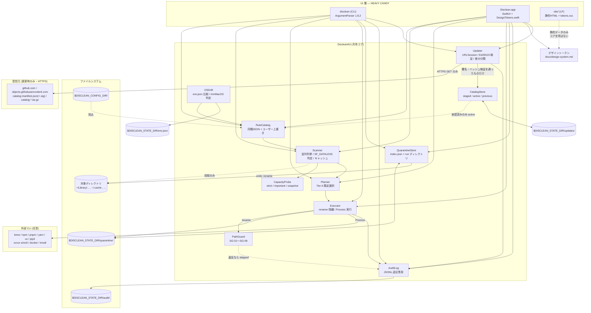

> 責務: アーキテクチャ概略（§9）— コンポーネント構成とデータフローを図で示す。
> 親: ../REQUIREMENTS.md

## 9. Architecture Sketch

#### 9.1 レイヤー責務

| レイヤー | 責務 | 禁止事項 |
|---|---|---|
| UI（`disclean` / `DiscleanApp`） | 引数解析・表示・確認プロンプト・進捗提示 | ファイルの削除・移動を直接行わない。パス検証ロジックを持たない。色・寸法のリテラル値を View に直接書かない（`DesignTokens` 経由） |
| LP（`site/`） | 製品の説明と配布先への誘導 | `DiscleanKit` を参照しない。ユーザーのマシンを読まない。訪問者データを記録しない。バイナリを配信しない |
| DiscleanKit | ルール評価・走査・計測・安全検証・実行・記録 | 標準出力への直接書き込みを行わない（結果は値として返す）。UI フレームワークに依存しない |
| Updater / CatalogStore（DiscleanKit 内） | 更新の取得・署名検証・差分分類・世代管理 | ファイルの削除・移動を行わない。承認前のカタログを `active` にしない。検証を省略する経路を持たない。**`URLSession` を使うのはこの層だけ** |
| ファイルシステム | 状態の唯一の source of truth | — |

#### 9.2 データフローの不変条件

1. `Scanner` は書き込み系 API を一切呼ばない（スキャンキャッシュの書き込みのみ `Scanner` の外側で行う）。
2. すべての削除・移動は `Executor` の 1 経路に集約し、その入口で必ず `PathGuard` を通す。`PathGuard` を迂回する経路をコード上に作らない。
3. `Executor` は破壊的操作の**前**に `AuditLog` への追記を試み、追記に失敗した場合は操作を行わない。
4. `directory` 型の削除は隔離庫への `rename` のみ。`FileManager.removeItem` を呼ぶのは `QuarantineStore.purge`（失効処理）だけとする。
5. 隔離庫と対象は常に同一ボリューム。異なる場合は移動せず `skipped(reason: "cross-volume")` にする（コピーへのフォールバックを行わない）。
6. LP は `DiscleanKit` にも実ファイルシステムにも触れない。ヒーローのデモは静的データで動き、その旨を画面上に明示する。
7. ネットワーク通信は `Updater` の 1 箇所に閉じる。`Scanner` / `Executor` / `QuarantineStore` / `AuditLog` は `URLSession` を参照しない（レビューと `grep` で検査する）。
8. 取得した配信物は、署名検証とハッシュ照合を通るまで `staged` の外に出さない。`active` への切り替えは `CatalogStore` の 1 経路のみで行う。
9. 更新カタログのルールも、同梱ルールと**同一の検証**（F-01 のスキーマ検証・禁止パス検証）を通す。更新経由であることを理由に検証を緩めない。
10. 更新チェックはコマンド本体の処理と並行し、その完了を待たない。ネットワークの失敗が終了コードに影響しない。
